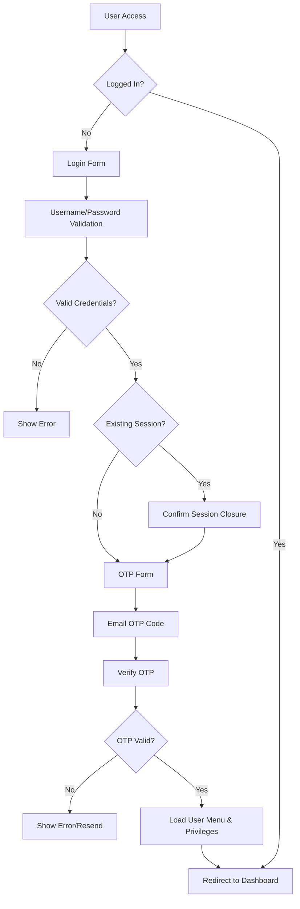
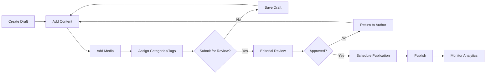
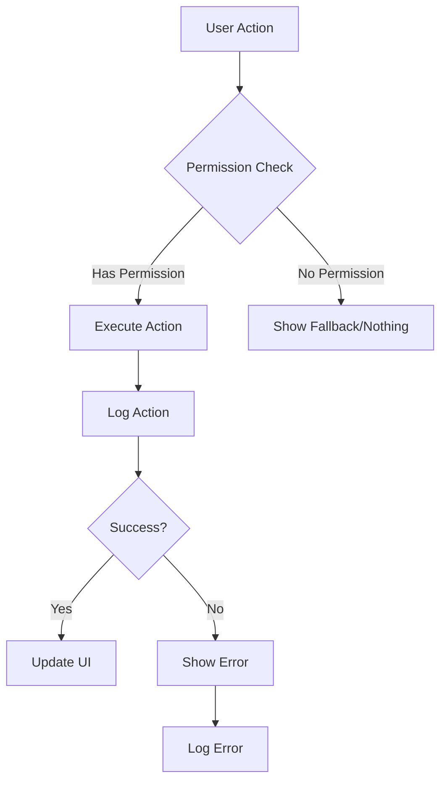
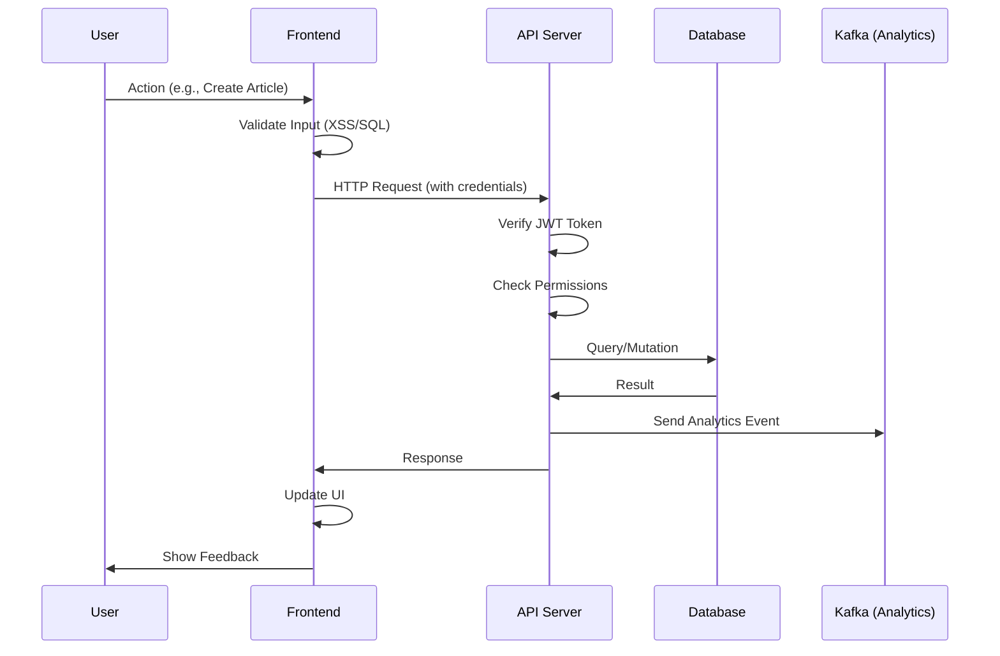

# APS Editorial Management System - Back Office


## 📋 Table of Contents

- [Introduction](#introduction)
- [Mission](#mission)
- [Features](#features)
- [System Workflow](#system-workflow)
- [Architecture Overview](#architecture-overview)
- [Technology Stack](#technology-stack)
- [Prerequisites](#prerequisites)
- [Installation](#installation)
- [Configuration](#configuration)
- [Development](#development)
- [Production Deployment](#production-deployment)
- [Folder Structure](#folder-structure)
- [API Documentation](#api-documentation)
- [Security](#security)
- [Contributing](#contributing)
- [License](#license)

---

## 🎯 Introduction

The **APS Editorial Management System (Back Office)** is a comprehensive web-based content management platform designed for **Algérie Presse Service (APS)** - Algeria's national news agency. This system empowers editorial teams to create, manage, and publish news articles across multiple languages and topics with role-based access control.

### Mission

To provide a secure, efficient, and user-friendly platform for managing multilingual news content while maintaining editorial workflows, user permissions, and content quality standards for Algeria's premier news agency.

---

## ✨ Features

### 🔐 Authentication & Security
- **Two-Factor Authentication (2FA)** with OTP verification
- **Session Management** with cookie-based authentication
- **Cross-tab Authentication** synchronization using BroadcastChannel API
- **JWT Token** authentication for API requests
- **XSS & SQL Injection Protection** with input sanitization
- **Rate Limiting** and brute force protection
- **Automatic User Blocking** on security violations
- **IP Address Logging** for security auditing

### 👥 User Management
- **Role-Based Access Control (RBAC)** with granular permissions
- **User Creation & Management** with email verification (@aps.dz domain)
- **Password Policy Enforcement** (8-16 chars, symbols, numbers)
- **User Profile Management** with avatar support
- **Phone Number Validation** (10-digit Algerian format)
- **Account Blocking/Unblocking** capabilities
- **Session Monitoring** across multiple devices

### 📝 Content Management
- **Rich Text Editor** using CKEditor 5 for article creation
- **Multilingual Support** (French, Arabic, English, Spanish, Russian, Chinese, Tamazight)
- **Article Lifecycle Management** (draft, review, published states)
- **Topic-Based Organization** with pools and followed articles
- **Category Management** with hierarchical structure
- **Tag System** for content classification
- **Image Management** with upload, optimization, and CDN integration
- **Media Galleries** (photos, videos, infographics)
- **Banner Management** for promotional content
- **Dossier/Series Management** for related articles

### 🎨 Editorial Workflow
- **Article Pool** - Central repository for all articles
- **Follow System** - Track articles assigned to you
- **Dynamic Routing** based on user topics and permissions
- **Draft Auto-Save** functionality
- **Content Scheduling** for future publication
- **URL Validation** (restricted to APS domains)
- **Content Versioning** and audit trails

### 🔍 Monitoring & Logging
- **Comprehensive Logging System** with log levels (error, warn, info)
- **Activity Logs** for all CRUD operations (articles, roles, users, categories, tags)
- **Login Error Tracking** with failed attempt monitoring
- **Session Logs** with IP address and user agent
- **Frontend Error Logging** sent to backend
- **Security Violation Logs** with automatic blocking (code 220)
- **Real-time Log Viewing** with filtering and search

### 🌐 Multi-Language Support
- **9 Supported Languages**:
  - French (fr) - Default
  - Arabic (ar) - RTL
  - English (en)
  - Spanish (es)
  - Russian (ru)
  - Chinese (cn)
  - Tamazight variants (arb, tal, tif)
- **Language-Specific Routing** with URL prefixes (e.g., /fr/, /ar/)
- **RTL Support** for Arabic and Tamazight
- **Localized Storage Keys** to prevent cross-language conflicts

### 🎨 User Interface
- **Material-UI (MUI)** component library for modern design
- **Responsive Design** with mobile, tablet, and desktop support
- **Dark Mode Support** (configurable)
- **Toast Notifications** for user feedback
- **Data Tables** with pagination, sorting, and filtering
- **Drag & Drop** functionality for media uploads
- **Modal Dialogs** for confirmations and forms
- **Tooltips** for enhanced UX
- **Loading States** with skeleton screens
- **404 Error Page** for invalid routes

---

## 🔄 System Workflow

### Authentication Flow



### Article Lifecycle



### Permission Check Flow



---

## 🏗️ Architecture Overview

### Frontend Architecture

```
┌─────────────────────────────────────────────────────────┐
│                    React Application                    │
│                                                          │
│  ┌────────────┐  ┌─────────────┐  ┌─────────────────┐  │
│  │   Router   │  │   Context   │  │  State Mgmt     │  │
│  │  (React    │  │   (Auth)    │  │  (useState/     │  │
│  │   Router)  │  │             │  │   useEffect)    │  │
│  └────────────┘  └─────────────┘  └─────────────────┘  │
│                                                          │
│  ┌────────────────────────────────────────────────────┐ │
│  │              Component Layer                       │ │
│  │  - Pages (Auth, Roles, Users, Topics, etc.)       │ │
│  │  - Components (Header, Sidebar, Footer, etc.)     │ │
│  │  - UI Components (Alerts, Dialogs, Tables)        │ │
│  └────────────────────────────────────────────────────┘ │
│                                                          │
│  ┌────────────────────────────────────────────────────┐ │
│  │              Service Layer                         │ │
│  │  - useAxios (HTTP client)                          │ │
│  │  - Custom Logging                                  │ │
│  └────────────────────────────────────────────────────┘ │
│                                                          │
│  ┌────────────────────────────────────────────────────┐ │
│  │              Helper Layer                          │ │
│  │  - Validation Functions                            │ │
│  │  - Formatting Utilities                            │ │
│  │  - Security Checks (XSS/SQL)                       │ │
│  │  - Permission Guards                               │ │
│  └────────────────────────────────────────────────────┘ │
└─────────────────────────────────────────────────────────┘
                            ↓
                    ┌──────────────┐
                    │  Backend API │
                    │   (Node.js)  │
                    └──────────────┘
```

### Backend Architecture (High-Level)

```
┌────────────────────────────────────────────────────┐
│              Backend API Server                    │
│                                                    │
│  ┌──────────────────────────────────────────────┐ │
│  │         API Routes & Controllers             │ │
│  │  /auth, /roles, /users, /articles, /logs   │ │
│  └──────────────────────────────────────────────┘ │
│                     ↓                              │
│  ┌──────────────────────────────────────────────┐ │
│  │            Middleware Layer                  │ │
│  │  - Authentication (JWT)                      │ │
│  │  - Authorization (RBAC)                      │ │
│  │  - Rate Limiting                             │ │
│  │  - Input Validation                          │ │
│  │  - Error Handling                            │ │
│  └──────────────────────────────────────────────┘ │
│                     ↓                              │
│  ┌──────────────────────────────────────────────┐ │
│  │          Business Logic Layer                │ │
│  │  - User Management                           │ │
│  │  - Content Management                        │ │
│  │  - Permission Management                     │ │
│  └──────────────────────────────────────────────┘ │
│                     ↓                              │
│  ┌──────────────────────────────────────────────┐ │
│  │            Data Access Layer                 │ │
│  │  - Prisma ORM                                │ │
│  │  - Database Queries                          │ │
│  └──────────────────────────────────────────────┘ │
└────────────────────────────────────────────────────┘
                     ↓
        ┌────────────────────────┐
        │   PostgreSQL/MySQL     │
        │   Master Database      │
        └────────────────────────┘
                     ↓
        ┌────────────────────────┐
        │     Replica DB         │
        │    (Read-Only)         │
        └────────────────────────┘
```

### Data Flow



---

## 🛠️ Technology Stack

### Frontend
- **Framework**: React 18.2.0
- **Build Tool**: Vite 7.1.5
- **Router**: React Router DOM 6.22.0
- **UI Library**: Material-UI (MUI) 5.15.7
- **HTTP Client**: Axios 1.6.7
- **Rich Text Editor**: CKEditor 5 (46.1.0)
- **State Management**: React Context API + Hooks
- **Notifications**: React Toastify 10.0.6
- **Date Management**: Day.js 1.11.10
- **Icons**: Material Design Icons (@mdi/react)
- **Styling**: CSS Modules + Emotion
- **Drag & Drop**: React Beautiful DnD 13.1.1
- **Security**: DOMPurify 3.1.5 (XSS prevention)
- **Logging**: Loglevel 1.9.1 + Remote Plugin

### Backend (Expected)
- **Runtime**: Node.js
- **Framework**: Express.js (assumed)
- **ORM**: Prisma
- **Database**: PostgreSQL or MySQL
- **Authentication**: JWT + Session Cookies
- **Caching**: Redis (assumed)
- **Message Queue**: Apache Kafka (for analytics)
- **File Storage**: Local/CDN

### DevOps & Infrastructure
- **Web Server**: Apache (reverse proxy)
- **Process Manager**: PM2 or Docker containers
- **SSL/TLS**: Let's Encrypt or custom certificate
- **Version Control**: Git
- **Package Manager**: npm

---

## 📦 Prerequisites

Before installing, ensure you have:

- **Node.js** >= 18.0.0
- **npm** >= 9.0.0
- **Git**
- **Modern Browser** (Chrome 90+, Firefox 88+, Edge 90+, Safari 14+)
- **Backend API** running and accessible

---

## 🚀 Installation

### Development Environment Setup

1. **Clone the Repository**
   ```bash
   git clone <repository-url>
   cd workspace
   ```

2. **Install Dependencies**
   ```bash
   npm install
   ```

3. **Configure Environment Variables**
   
   Create a `.env.development` file in the root directory:
   ```env
   # Backend API Configuration
   VITE_BASE_URL=http://localhost:3000/api/
   VITE_IMAGE_URL=http://localhost:3000/images/
   VITE_URL_FRONTAL=https://www.aps.dz
   
   # Application Configuration
   VITE_LAN=fr
   VITE_EMPTY_DATA=Aucune donnée disponible
   VITE_MAX_IMAGE_SIZE=5242880
   ```

4. **Start Development Server**
   ```bash
   npm run dev
   ```

   The application will be available at:
   - **French**: `http://localhost:5173/fr/`
   - **Arabic**: `http://localhost:5173/ar/`
   - **English**: `http://localhost:5173/en/`

---

## ⚙️ Configuration

### Environment Variables

| Variable | Description | Example | Required |
|----------|-------------|---------|----------|
| `VITE_BASE_URL` | Backend API base URL | `https://api.aps.dz/` | ✅ |
| `VITE_IMAGE_URL` | Image CDN URL | `https://cdn.aps.dz/images/` | ✅ |
| `VITE_URL_FRONTAL` | Frontend public URL | `https://www.aps.dz` | ✅ |
| `VITE_LAN` | Default language code | `fr` | ✅ |
| `VITE_EMPTY_DATA` | Empty state message | `No data available` | ✅ |
| `VITE_MAX_IMAGE_SIZE` | Max image size (bytes) | `5242880` (5MB) | ✅ |

### Vite Configuration

The `vite.config.js` file configures:
- **Base path** with language prefix
- **Development server** with custom host/port
- **Allowed hosts** for HMR (Hot Module Replacement)
- **Path aliases** for imports

Example:
```javascript
export default defineConfig(({ mode }) => {
  const env = loadEnv(mode, process.cwd());
  const lang = env.VITE_LAN || "fr";
  
  return {
    base: `/${lang}/`,
    server: {
      host: "0.0.0.0",
      port: 5173,
      allowedHosts: ["dev-redactionnelle.aps.dz", "redactionnelle.aps.dz"],
    },
    plugins: [react()],
  };
});
```

---

## 👨‍💻 Development

### Available Scripts

```bash
# Start development server with HMR
npm run dev

# Build for production
npm run build

# Preview production build
npm run preview

# Lint code
npm run lint
```

### Development Workflow

1. **Create Feature Branch**
   ```bash
   git checkout -b feature/your-feature-name
   ```

2. **Make Changes**
   - Edit files in `src/`
   - Hot Module Replacement (HMR) will auto-reload

3. **Test Locally**
   - Test all supported languages
   - Verify permissions and role-based access
   - Check responsive design

4. **Commit Changes**
   ```bash
   git add .
   git commit -m "feat: add your feature description"
   ```

### Code Style Guidelines

- **Use functional components** with hooks
- **Document with JSDoc** for all functions
- **Validate all inputs** with XSS/SQL checks
- **Handle errors gracefully** with user-friendly messages
- **Use consistent naming**:
  - Components: PascalCase
  - Functions/Variables: camelCase
  - Constants: UPPER_SNAKE_CASE
  - Files: camelCase or kebab-case

---

## 🚀 Production Deployment

### Build for Production

1. **Create Production Environment File**
   
   `.env.production`:
   ```env
   VITE_BASE_URL=https://api.aps.dz/
   VITE_IMAGE_URL=https://cdn.aps.dz/images/
   VITE_URL_FRONTAL=https://www.aps.dz
   VITE_LAN=fr
   VITE_EMPTY_DATA=Aucune donnée disponible
   VITE_MAX_IMAGE_SIZE=5242880
   ```

2. **Build the Application**
   ```bash
   npm run build
   ```
   
   Output will be in `dist/` directory.

3. **Test Production Build Locally**
   ```bash
   npm run preview
   ```

### Apache Configuration

Example Apache VirtualHost configuration:

```apache
<VirtualHost *:443>
    ServerName redactionnelle.aps.dz
    
    SSLEngine on
    SSLCertificateFile /path/to/certificate.crt
    SSLCertificateKeyFile /path/to/private.key
    SSLCertificateChainFile /path/to/chain.crt
    
    DocumentRoot /var/www/aps-backoffice/dist
    
    <Directory /var/www/aps-backoffice/dist>
        Options -Indexes +FollowSymLinks
        AllowOverride All
        Require all granted
        
        # React Router support
        RewriteEngine On
        RewriteBase /
        RewriteRule ^index\.html$ - [L]
        RewriteCond %{REQUEST_FILENAME} !-f
        RewriteCond %{REQUEST_FILENAME} !-d
        RewriteRule . /index.html [L]
    </Directory>
    
    # API Proxy (if backend on same server)
    ProxyPass /api http://localhost:3000/api
    ProxyPassReverse /api http://localhost:3000/api
    
    # Compression
    <IfModule mod_deflate.c>
        AddOutputFilterByType DEFLATE text/html text/plain text/xml text/css application/javascript
    </IfModule>
    
    # Browser Caching
    <IfModule mod_expires.c>
        ExpiresActive On
        ExpiresByType image/jpg "access plus 1 year"
        ExpiresByType image/jpeg "access plus 1 year"
        ExpiresByType image/gif "access plus 1 year"
        ExpiresByType image/png "access plus 1 year"
        ExpiresByType text/css "access plus 1 month"
        ExpiresByType application/javascript "access plus 1 month"
    </IfModule>
</VirtualHost>
```

### PM2 Deployment (if using Node.js for serving)

```bash
# Install PM2 globally
npm install -g pm2

# Serve built files with PM2
pm2 serve dist/ 5173 --name aps-backoffice --spa

# Save PM2 configuration
pm2 save

# Setup PM2 startup script
pm2 startup
```

### Docker Deployment

Create `Dockerfile`:
```dockerfile
FROM node:18-alpine AS builder

WORKDIR /app
COPY package*.json ./
RUN npm ci
COPY . .
RUN npm run build

FROM nginx:alpine
COPY --from=builder /app/dist /usr/share/nginx/html
COPY nginx.conf /etc/nginx/conf.d/default.conf
EXPOSE 80
CMD ["nginx", "-g", "daemon off;"]
```

Build and run:
```bash
docker build -t aps-backoffice .
docker run -d -p 80:80 aps-backoffice
```

---

## 📁 Folder Structure

```
workspace/
├── public/                      # Static public assets
│   ├── favicon.ico             # Application favicon
│   └── param.json              # Configuration parameters
│
├── src/                        # Source code
│   ├── assets/                 # Images, styles, and static resources
│   │   ├── images/            # Image files
│   │   │   ├── logos/         # APS logos
│   │   │   ├── defaultImage.png
│   │   │   └── user.png
│   │   └── styles/            # Global styles
│   │       ├── global.css     # Global CSS
│   │       ├── theme.jsx      # MUI theme configuration
│   │       └── *.css          # Component-specific styles
│   │
│   ├── components/            # Reusable components
│   │   ├── Header/           # Header component with notifications
│   │   ├── Sidebar/          # Navigation sidebar
│   │   ├── Footer/           # Footer component
│   │   ├── styled/           # Styled components
│   │   └── ui/               # UI components (alerts, dialogs, etc.)
│   │
│   ├── Context/              # React Context providers
│   │   └── AuthContext.jsx  # Authentication context
│   │
│   ├── data/                 # Static data and configurations
│   │   └── menu.jsx         # Menu configuration
│   │
│   ├── helpers/              # Helper functions and utilities
│   │   ├── Gfunc.js         # Global helper functions
│   │   └── PermissionGuard.js # Permission checking HOC
│   │
│   ├── lang/                 # Multi-language configuration
│   │   └── index.js         # Language definitions
│   │
│   ├── log/                  # Logging configuration
│   │   └── costumLog.js     # Custom logger
│   │
│   ├── pages/                # Page components
│   │   ├── Auth/            # Authentication pages
│   │   │   ├── index.jsx   # Auth layout
│   │   │   ├── AuthForm.jsx # Login form
│   │   │   └── otpForm.jsx  # OTP verification
│   │   ├── Roles/           # Role management
│   │   ├── Utilisateurs/    # User management
│   │   ├── Topics/          # Topic/article management
│   │   │   ├── index.jsx
│   │   │   ├── pool.jsx     # Article pool
│   │   │   ├── follow.jsx   # Followed articles
│   │   │   └── poolDetails.jsx
│   │   └── index.jsx        # Main pages layout
│   │
│   ├── services/             # API services
│   │   └── useAxios.jsx     # Custom Axios hook
│   │
│   ├── 404.jsx               # 404 error page
│   ├── App.jsx               # Main App component
│   ├── App.css               # App styles
│   ├── ckEditor.css          # CKEditor styles
│   ├── ckEditor.jsx          # CKEditor component
│   └── main.jsx              # Application entry point
│
├── docs/                      # Documentation (see docs/ folder)
│   ├── workflow.md
│   ├── architecture.md
│   ├── api.md
│   ├── permissions.md
│   ├── database-schema.md
│   ├── deployment.md
│   └── security.md
│
├── index.html                 # HTML entry point
├── package.json               # Dependencies and scripts
├── vite.config.js            # Vite configuration
└── README.md                  # This file
```

---

## 📚 API Documentation

For detailed API documentation, see [docs/api.md](./docs/api.md)

### Main API Endpoints

#### Authentication
- `POST /auth/login` - User login
- `POST /auth/logout` - User logout
- `POST /auth/menu` - Get user menu and privileges
- `POST /auth/close` - Close existing session

#### Users
- `POST /users` - List users
- `POST /users/create` - Create user
- `PUT /users/update` - Update user
- `PUT /users/delete` - Delete user
- `PUT /users/block` - Block user

#### Roles
- `POST /roles` - List roles
- `POST /roles/create` - Create role
- `PUT /roles/update` - Update role
- `PUT /roles/delete` - Delete role
- `POST /roles/privileges` - Get role privileges
- `PUT /roles/privileges/update` - Update role privileges

#### Articles (Topics)
- `POST /articles` - List articles
- `POST /articles/create` - Create article
- `PUT /articles/update` - Update article
- `DELETE /articles/:id` - Delete article
- `GET /articles/:id` - Get article details

#### Logs
- `POST /logs/front` - Submit frontend log
- `GET /logs/:type` - Get logs by type (users, roles, articles, etc.)
- `GET /logs/sessions` - Get session logs

For complete API documentation with request/response examples, see [docs/api.md](./docs/api.md).

---

## 🔒 Security

### Security Measures Implemented

1. **Input Validation**
   - XSS prevention with DOMPurify
   - SQL injection detection with regex patterns
   - HTML tag stripping in user inputs
   - Special character validation

2. **Authentication & Authorization**
   - JWT token-based authentication
   - Session cookies with httpOnly flag
   - OTP verification for login
   - Permission-based access control (RBAC)
   - Cross-tab session management

3. **Password Security**
   - 8-16 character requirement
   - Must contain letters, numbers, and symbols
   - Cannot contain username
   - Backend hashing (bcrypt/argon2 expected)

4. **Rate Limiting**
   - Login attempt limiting
   - API request throttling
   - Automatic account blocking on violations

5. **Logging & Monitoring**
   - All actions logged with user context
   - Security violations logged (code 220)
   - IP address tracking
   - Failed login attempt monitoring

6. **CORS & CSP**
   - CORS configured for allowed origins
   - Content Security Policy headers
   - Helmet.js middleware (backend)

7. **Data Validation**
   - Email domain restriction (@aps.dz)
   - URL whitelist (APS domains only)
   - Phone number format validation
   - File type and size restrictions

For detailed security documentation, see [docs/security.md](./docs/security.md).

---

## 🤝 Contributing

### Contribution Guidelines

1. **Fork the Repository**
2. **Create Feature Branch** (`git checkout -b feature/AmazingFeature`)
3. **Commit Changes** (`git commit -m 'Add some AmazingFeature'`)
4. **Push to Branch** (`git push origin feature/AmazingFeature`)
5. **Open Pull Request**

### Code Review Process

- All PRs require review by at least one maintainer
- Automated tests must pass
- Code must follow style guidelines
- Documentation must be updated

### Reporting Issues

Please use GitHub Issues to report bugs or request features. Include:
- Clear description of the issue
- Steps to reproduce
- Expected vs actual behavior
- Screenshots if applicable
- Environment details (browser, OS, etc.)

---

## 📄 License

Copyright © 2024 Algérie Presse Service (APS). All rights reserved.

This project is proprietary software developed for internal use by APS.

---

## 📞 Support & Contact

- **Email**: support@aps.dz
- **Website**: https://www.aps.dz
- **Documentation**: [docs/](./docs/)

---

## 🙏 Acknowledgments

- **Algérie Presse Service (APS)** - Algeria's national news agency
- **Development Team** - For their dedication to building a robust editorial system
- **Open Source Community** - For the amazing libraries and tools used in this project

---

## 📝 Changelog

See [CHANGELOG.md](./CHANGELOG.md) for detailed version history (if available).

---

**Made with ❤️ by the APS Development Team**
