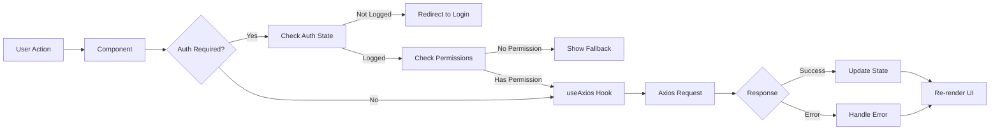
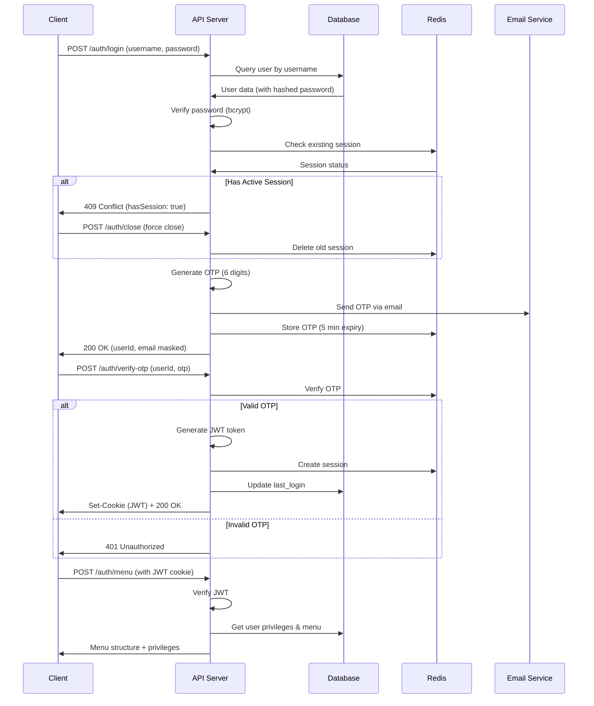

# System Architecture Documentation

## Overview

This document provides a comprehensive overview of the APS Editorial Management System architecture, including frontend, backend, database design, infrastructure, and data flow.

---

## Table of Contents

- [High-Level Architecture](#high-level-architecture)
- [Frontend Architecture](#frontend-architecture)
- [Backend Architecture](#backend-architecture)
- [Database Architecture](#database-architecture)
- [Infrastructure & Deployment](#infrastructure--deployment)
- [Data Flow](#data-flow)
- [Microservices Overview](#microservices-overview)
- [Replica Database Architecture](#replica-database-architecture)
- [Kafka Analytics Event Flow](#kafka-analytics-event-flow)
- [Caching Strategy](#caching-strategy)
- [Security Architecture](#security-architecture)
- [Scalability & Performance](#scalability--performance)

---

## High-Level Architecture

```
┌─────────────────────────────────────────────────────────────────┐
│                          Client Layer                           │
│  ┌──────────────┐  ┌──────────────┐  ┌──────────────┐         │
│  │   Desktop    │  │    Tablet    │  │    Mobile    │         │
│  │   Browser    │  │   Browser    │  │   Browser    │         │
│  └──────────────┘  └──────────────┘  └──────────────┘         │
└─────────────────────────────────────────────────────────────────┘
                              ↓ HTTPS
┌─────────────────────────────────────────────────────────────────┐
│                      Load Balancer / CDN                        │
│                   (Apache + SSL Termination)                    │
└─────────────────────────────────────────────────────────────────┘
                              ↓
        ┌─────────────────────────────────────────┐
        │          Frontend Application           │
        │         (React + Vite - SPA)            │
        │  Served as static files from Apache     │
        └─────────────────────────────────────────┘
                              ↓ REST API
┌─────────────────────────────────────────────────────────────────┐
│                       API Gateway Layer                         │
│                    (Reverse Proxy - Apache)                     │
│          ┌────────────────────────────────────┐                 │
│          │  - Rate Limiting                   │                 │
│          │  - Request Routing                 │                 │
│          │  - SSL/TLS Termination             │                 │
│          └────────────────────────────────────┘                 │
└─────────────────────────────────────────────────────────────────┘
                              ↓
┌─────────────────────────────────────────────────────────────────┐
│                      Backend API Server                         │
│                      (Node.js + Express)                        │
│  ┌────────────┐  ┌────────────┐  ┌────────────┐               │
│  │   Auth     │  │  Content   │  │   User     │               │
│  │  Service   │  │  Service   │  │  Service   │               │
│  └────────────┘  └────────────┘  └────────────┘               │
│  ┌────────────┐  ┌────────────┐  ┌────────────┐               │
│  │   Media    │  │   Logs     │  │   Roles    │               │
│  │  Service   │  │  Service   │  │  Service   │               │
│  └────────────┘  └────────────┘  └────────────┘               │
└─────────────────────────────────────────────────────────────────┘
                              ↓
┌─────────────────────────────────────────────────────────────────┐
│                        Data Layer                               │
│  ┌─────────────────┐  ┌──────────────┐  ┌──────────────┐      │
│  │  PostgreSQL/    │  │    Redis     │  │   Apache     │      │
│  │  MySQL Master   │  │   (Cache)    │  │   Kafka      │      │
│  │   (Write/Read)  │  │              │  │  (Events)    │      │
│  └─────────────────┘  └──────────────┘  └──────────────┘      │
│          ↓                                                      │
│  ┌─────────────────┐  ┌──────────────┐                        │
│  │  Database       │  │   File       │                        │
│  │  Replica        │  │   Storage    │                        │
│  │  (Read-Only)    │  │   / CDN      │                        │
│  └─────────────────┘  └──────────────┘                        │
└─────────────────────────────────────────────────────────────────┘
```

---

## Frontend Architecture

### Technology Stack

- **Framework**: React 18.2.0
- **Build Tool**: Vite 7.1.5
- **Routing**: React Router DOM 6.22.0
- **State Management**: React Context API + Hooks
- **UI Library**: Material-UI (MUI) 5.15.7
- **HTTP Client**: Axios 1.6.7
- **Rich Text Editor**: CKEditor 5
- **Styling**: CSS Modules + Emotion (CSS-in-JS)

### Component Architecture

```
┌───────────────────────────────────────────────────────────┐
│                      App.jsx (Root)                       │
│  ┌─────────────────────────────────────────────────────┐ │
│  │          React Router (BrowserRouter)               │ │
│  │  ┌───────────────────────────────────────────────┐  │ │
│  │  │     AuthContext Provider                       │  │ │
│  │  │  ┌─────────────────────────────────────────┐  │  │ │
│  │  │  │     MUI ThemeProvider                   │  │  │ │
│  │  │  │  ┌───────────────────────────────────┐  │  │  │ │
│  │  │  │  │        Routes                     │  │  │  │ │
│  │  │  │  │  - /login                         │  │  │  │ │
│  │  │  │  │  - /                              │  │  │  │ │
│  │  │  │  │    - Dynamic Topic Routes         │  │  │  │ │
│  │  │  │  │    - Dynamic Page Routes          │  │  │  │ │
│  │  │  │  └───────────────────────────────────┘  │  │  │ │
│  │  │  └─────────────────────────────────────────┘  │  │ │
│  │  └───────────────────────────────────────────────┘  │ │
│  └─────────────────────────────────────────────────────┘ │
└───────────────────────────────────────────────────────────┘
```

### State Management

**Global State (Context API)**
- Authentication state (isLogged, isExisted)
- User privileges/permissions
- Menu structure (detailedMenu)
- Application configuration (URLs, language, etc.)
- Cross-tab authentication channel

**Local State (useState)**
- Component-specific data
- Form inputs
- UI state (modals, dialogs)
- Loading states
- Error messages

**Server State (useAxios)**
- API responses
- Loading indicators
- Error handling
- Request caching

### Routing Strategy

**Multi-Language Routing**
```
Base Path: /{language}/
Examples:
  /fr/login          → French login
  /ar/articles/pool  → Arabic articles pool
  /en/roles          → English roles page
```

**Dynamic Route Loading**
- Routes loaded from backend based on user permissions
- Components lazy-loaded using dynamic imports
- Topic routes support sub-routes (pool, follow)

**Protected Routes**
- Authentication check via `isLogged` state
- Permission check via `PermissionGuard` component
- Automatic redirect to login if unauthorized

### Data Flow (Frontend)



---

## Backend Architecture

### Technology Stack (Expected/Inferred)

- **Runtime**: Node.js (v18+)
- **Framework**: Express.js
- **ORM**: Prisma
- **Authentication**: JWT + Session Cookies
- **Database**: PostgreSQL or MySQL
- **Caching**: Redis
- **Message Queue**: Apache Kafka
- **Validation**: Express Validator / Joi
- **Security**: Helmet, CORS, Rate Limiting
- **Logging**: Winston / Pino
- **File Upload**: Multer
- **Process Manager**: PM2

### API Architecture

**RESTful API Design**

```
/api/
  /auth/
    POST /login           → Authenticate user
    POST /logout          → Logout user
    POST /menu            → Get user menu & privileges
    POST /close           → Close existing session
    POST /verify-otp      → Verify OTP code
    POST /resend-otp      → Resend OTP
  
  /users/
    POST /                → List users (with pagination)
    POST /create          → Create new user
    PUT /update           → Update user
    PUT /delete           → Soft delete user
    PUT /block            → Block user account
    GET /:id              → Get user details
  
  /roles/
    POST /                → List roles
    POST /create          → Create role
    PUT /update           → Update role
    PUT /delete           → Delete role
    POST /privileges      → Get role privileges
    PUT /privileges/update → Update privileges
    POST /users           → Get users with role
    PUT /users/add        → Add user to role
  
  /articles/
    POST /                → List articles (with filters)
    POST /create          → Create article
    PUT /update           → Update article
    DELETE /:id           → Delete article
    GET /:id              → Get article details
    PUT /publish          → Publish article
    PUT /schedule         → Schedule publication
  
  /topics/
    GET /                 → List topics
    GET /:id              → Get topic details
    POST /create          → Create topic (admin)
    PUT /update           → Update topic
  
  /categories/
    GET /                 → List categories
    POST /create          → Create category
    PUT /update           → Update category
    DELETE /:id           → Delete category
  
  /tags/
    GET /                 → List tags
    POST /create          → Create tag
    PUT /update           → Update tag
    DELETE /:id           → Delete tag
  
  /media/
    POST /upload          → Upload media file
    GET /:id              → Get media details
    DELETE /:id           → Delete media
  
  /logs/
    POST /front           → Log frontend event
    GET /:type            → Get logs by type
    GET /sessions         → Get session logs
```

### Middleware Stack

```javascript
app.use(helmet());                    // Security headers
app.use(cors(corsOptions));           // CORS policy
app.use(express.json());              // JSON parser
app.use(cookieParser());              // Cookie parser
app.use(rateLimiter);                 // Rate limiting
app.use(authenticateJWT);             // JWT verification
app.use(authorizePermissions);        // Permission check
app.use(inputValidation);             // Input sanitization
app.use(errorHandler);                // Error handling
```

### Controller Structure

```javascript
// Example: articles.controller.js

exports.listArticles = async (req, res) => {
  try {
    // 1. Extract user from JWT
    const userId = req.user.id;
    
    // 2. Get user's accessible topics
    const userTopics = await getUserTopics(userId);
    
    // 3. Query articles with permissions
    const articles = await prisma.article.findMany({
      where: {
        topicId: { in: userTopics },
        deletedAt: null
      },
      include: {
        author: true,
        categories: true,
        tags: true
      },
      orderBy: { createdAt: 'desc' }
    });
    
    // 4. Send response
    res.json({ success: true, data: articles });
  } catch (error) {
    // 5. Error handling
    logger.error('Error listing articles:', error);
    res.status(500).json({ success: false, message: 'Server error' });
  }
};
```

### Authentication Flow



---

## Database Architecture

### Database Schema Overview

```
┌─────────────────────────────────────────────────────────────┐
│                      Users & Auth                           │
│  ┌──────────┐  ┌──────────┐  ┌──────────┐  ┌──────────┐   │
│  │  users   │  │  roles   │  │user_roles│  │ sessions │   │
│  └──────────┘  └──────────┘  └──────────┘  └──────────┘   │
└─────────────────────────────────────────────────────────────┘

┌─────────────────────────────────────────────────────────────┐
│                    Content Management                       │
│  ┌──────────┐  ┌──────────┐  ┌──────────┐  ┌──────────┐   │
│  │ articles │  │  topics  │  │categories│  │   tags   │   │
│  └──────────┘  └──────────┘  └──────────┘  └──────────┘   │
│  ┌──────────┐  ┌──────────┐  ┌──────────┐                 │
│  │art_cats  │  │art_tags  │  │  media   │                 │
│  └──────────┘  └──────────┘  └──────────┘                 │
└─────────────────────────────────────────────────────────────┘

┌─────────────────────────────────────────────────────────────┐
│               Permissions & Access Control                  │
│  ┌──────────┐  ┌──────────┐  ┌──────────┐                 │
│  │privileges│  │role_priv │  │topic_acc │                 │
│  └──────────┘  └──────────┘  └──────────┘                 │
└─────────────────────────────────────────────────────────────┘

┌─────────────────────────────────────────────────────────────┐
│                   Logging & Auditing                        │
│  ┌──────────┐  ┌──────────┐  ┌──────────┐  ┌──────────┐   │
│  │user_logs │  │role_logs │  │art_logs  │  │login_err │   │
│  └──────────┘  └──────────┘  └──────────┘  └──────────┘   │
└─────────────────────────────────────────────────────────────┘
```

### Key Tables

#### users
```sql
CREATE TABLE users (
  id_user         SERIAL PRIMARY KEY,
  username        VARCHAR(100) UNIQUE NOT NULL,
  email           VARCHAR(255) UNIQUE NOT NULL,
  password_hash   VARCHAR(255) NOT NULL,
  full_name       VARCHAR(255),
  phone           VARCHAR(20),
  avatar_url      VARCHAR(500),
  is_active       BOOLEAN DEFAULT true,
  is_blocked      BOOLEAN DEFAULT false,
  block_reason    VARCHAR(500),
  last_login      TIMESTAMP,
  created_at      TIMESTAMP DEFAULT CURRENT_TIMESTAMP,
  updated_at      TIMESTAMP DEFAULT CURRENT_TIMESTAMP,
  created_by      INT REFERENCES users(id_user),
  INDEX idx_username (username),
  INDEX idx_email (email)
);
```

#### roles
```sql
CREATE TABLE roles (
  id_role       SERIAL PRIMARY KEY,
  name          VARCHAR(100) UNIQUE NOT NULL,
  description   TEXT,
  created_date  TIMESTAMP DEFAULT CURRENT_TIMESTAMP,
  created_by    INT REFERENCES users(id_user),
  updated_at    TIMESTAMP DEFAULT CURRENT_TIMESTAMP
);
```

#### articles
```sql
CREATE TABLE articles (
  id_article       SERIAL PRIMARY KEY,
  title            VARCHAR(500) NOT NULL,
  content_intro    TEXT,
  content_full     TEXT,
  status           ENUM('draft', 'review', 'approved', 'published', 'archived'),
  topic_id         INT REFERENCES topics(id_topic),
  author_id        INT REFERENCES users(id_user),
  published_at     TIMESTAMP,
  scheduled_at     TIMESTAMP,
  views            INT DEFAULT 0,
  language         VARCHAR(10),
  featured_image   VARCHAR(500),
  created_at       TIMESTAMP DEFAULT CURRENT_TIMESTAMP,
  updated_at       TIMESTAMP DEFAULT CURRENT_TIMESTAMP,
  deleted_at       TIMESTAMP,
  INDEX idx_status (status),
  INDEX idx_topic (topic_id),
  INDEX idx_author (author_id),
  INDEX idx_published (published_at)
);
```

### Indexing Strategy

**Primary Indexes:**
- Primary keys on all tables
- Foreign key indexes for relationships

**Performance Indexes:**
- `users.username` - Fast login lookup
- `users.email` - Email validation
- `articles.status` - Filter by state
- `articles.topic_id` - Topic-based queries
- `articles.published_at` - Chronological sorting
- `sessions.user_id` - Session lookup
- `logs.created_at` - Log querying by date

**Composite Indexes:**
- `articles(topic_id, status)` - Topic articles by state
- `articles(author_id, status)` - User's articles
- `logs(user_id, created_at)` - User activity logs

---

## Replica Database Architecture

### Master-Replica Setup

```
┌─────────────────────────────────────────┐
│         Master Database                 │
│      (Read + Write Operations)          │
│  ┌───────────────────────────────────┐  │
│  │  - User authentication            │  │
│  │  - Article creation/update        │  │
│  │  - Role management                │  │
│  │  - Write-heavy operations         │  │
│  └───────────────────────────────────┘  │
└─────────────────────────────────────────┘
                 ↓ Replication
        ┌────────────────────┐
        │  Binary Log Stream │
        └────────────────────┘
                 ↓
┌─────────────────────────────────────────┐
│       Replica Database (Slave)          │
│       (Read-Only Operations)            │
│  ┌───────────────────────────────────┐  │
│  │  - Article listing                │  │
│  │  - Search queries                 │  │
│  │  - Reports generation             │  │
│  │  - Analytics queries              │  │
│  └───────────────────────────────────┘  │
└─────────────────────────────────────────┘
```

### Replication Configuration

**MySQL Replication Example:**
```sql
-- Master configuration (my.cnf)
[mysqld]
server-id = 1
log-bin = mysql-bin
binlog-do-db = aps_editorial
binlog-format = ROW

-- Replica configuration (my.cnf)
[mysqld]
server-id = 2
relay-log = mysql-relay-bin
read-only = 1
```

### Read-Write Splitting

```javascript
// Prisma configuration with read replicas
const prisma = new PrismaClient({
  datasources: {
    db: {
      url: process.env.DATABASE_URL_MASTER  // Write operations
    }
  }
});

const prismaReadReplica = new PrismaClient({
  datasources: {
    db: {
      url: process.env.DATABASE_URL_REPLICA  // Read operations
    }
  }
});

// Usage in services
exports.getArticles = async () => {
  // Read from replica
  return await prismaReadReplica.article.findMany();
};

exports.createArticle = async (data) => {
  // Write to master
  return await prisma.article.create({ data });
};
```

---

## Kafka Analytics Event Flow

### Event Architecture

```
┌──────────────────────────────────────────────────────────────┐
│                    Event Producers                           │
│  ┌────────────┐  ┌────────────┐  ┌────────────┐            │
│  │  Frontend  │  │  Backend   │  │  Services  │            │
│  │   Events   │  │   Events   │  │   Events   │            │
│  └────────────┘  └────────────┘  └────────────┘            │
└──────────────────────────────────────────────────────────────┘
                         ↓
┌──────────────────────────────────────────────────────────────┐
│                   Apache Kafka Cluster                       │
│  ┌──────────────────────────────────────────────────────┐   │
│  │              Topics                                   │   │
│  │  - user-events       (login, logout, actions)        │   │
│  │  - article-events    (create, update, publish)       │   │
│  │  - analytics-events  (views, clicks, engagement)     │   │
│  │  - audit-events      (security, changes)             │   │
│  └──────────────────────────────────────────────────────┘   │
└──────────────────────────────────────────────────────────────┘
                         ↓
┌──────────────────────────────────────────────────────────────┐
│                   Event Consumers                            │
│  ┌────────────┐  ┌────────────┐  ┌────────────┐            │
│  │ Analytics  │  │   Data     │  │   Alert    │            │
│  │  Service   │  │ Warehouse  │  │  Service   │            │
│  └────────────┘  └────────────┘  └────────────┘            │
└──────────────────────────────────────────────────────────────┘
```

### Event Types

**User Events**
```json
{
  "eventType": "user.login",
  "userId": 123,
  "timestamp": "2024-01-15T10:30:00Z",
  "ipAddress": "192.168.1.1",
  "userAgent": "Mozilla/5.0...",
  "success": true
}
```

**Article Events**
```json
{
  "eventType": "article.published",
  "articleId": 456,
  "userId": 123,
  "topicId": 5,
  "timestamp": "2024-01-15T11:00:00Z",
  "metadata": {
    "title": "Breaking News...",
    "language": "fr",
    "categories": ["politics", "national"]
  }
}
```

**Analytics Events**
```json
{
  "eventType": "article.view",
  "articleId": 456,
  "userId": null,
  "sessionId": "abc123",
  "timestamp": "2024-01-15T11:05:00Z",
  "metadata": {
    "referrer": "https://www.google.com",
    "duration": 120,
    "scrollDepth": 75
  }
}
```

### Kafka Configuration

```javascript
// Kafka Producer (Backend)
const kafka = new Kafka({
  clientId: 'aps-editorial-backend',
  brokers: ['kafka1:9092', 'kafka2:9092']
});

const producer = kafka.producer();

exports.logArticleEvent = async (event) => {
  await producer.send({
    topic: 'article-events',
    messages: [
      {
        key: event.articleId.toString(),
        value: JSON.stringify(event),
        timestamp: Date.now()
      }
    ]
  });
};
```

```javascript
// Kafka Consumer (Analytics Service)
const consumer = kafka.consumer({ groupId: 'analytics-group' });

await consumer.subscribe({ topic: 'article-events' });

await consumer.run({
  eachMessage: async ({ topic, partition, message }) => {
    const event = JSON.parse(message.value.toString());
    
    // Process analytics
    if (event.eventType === 'article.view') {
      await incrementViewCount(event.articleId);
      await trackUserEngagement(event);
    }
  }
});
```

---

## Caching Strategy

### Redis Cache Architecture

```
┌──────────────────────────────────────────┐
│           Redis Cache                    │
│  ┌────────────────────────────────────┐  │
│  │  Session Store                     │  │
│  │  - JWT tokens                      │  │
│  │  - OTP codes (5 min TTL)           │  │
│  │  - User sessions (30 min TTL)     │  │
│  └────────────────────────────────────┘  │
│  ┌────────────────────────────────────┐  │
│  │  Application Cache                 │  │
│  │  - User menu (1 hour TTL)          │  │
│  │  - Article lists (5 min TTL)       │  │
│  │  - Category tree (1 hour TTL)      │  │
│  └────────────────────────────────────┘  │
│  ┌────────────────────────────────────┐  │
│  │  Rate Limiting                     │  │
│  │  - API request counters            │  │
│  │  - Login attempt tracking          │  │
│  └────────────────────────────────────┘  │
└──────────────────────────────────────────┘
```

### Cache Patterns

**Cache-Aside Pattern**
```javascript
async function getArticle(id) {
  // 1. Check cache first
  const cached = await redis.get(`article:${id}`);
  if (cached) return JSON.parse(cached);
  
  // 2. Query database
  const article = await prisma.article.findUnique({ where: { id } });
  
  // 3. Store in cache
  await redis.setex(`article:${id}`, 300, JSON.stringify(article));
  
  return article;
}
```

**Write-Through Pattern**
```javascript
async function updateArticle(id, data) {
  // 1. Update database
  const article = await prisma.article.update({
    where: { id },
    data
  });
  
  // 2. Update cache
  await redis.setex(`article:${id}`, 300, JSON.stringify(article));
  
  // 3. Invalidate related caches
  await redis.del(`articles:list:${article.topicId}`);
  
  return article;
}
```

---

## Security Architecture

See [security.md](./security.md) for detailed security documentation.

**Key Security Layers:**

1. **Transport Layer**: HTTPS/TLS 1.3
2. **Application Layer**: JWT + Session Cookies
3. **Data Layer**: Input validation, XSS/SQL prevention
4. **Infrastructure Layer**: Firewall, DDoS protection
5. **Monitoring Layer**: Logging, alerting, anomaly detection

---

## Scalability & Performance

### Horizontal Scaling

**Backend Scaling**
```
Load Balancer
    ↓
┌─────────┐  ┌─────────┐  ┌─────────┐
│ API 1   │  │ API 2   │  │ API 3   │
└─────────┘  └─────────┘  └─────────┘
    ↓            ↓            ↓
    └────────────┼────────────┘
            Database Pool
```

**Database Scaling**
- Master-Replica for read scaling
- Connection pooling (max 100 connections)
- Query optimization with indexes
- Partitioning by date for logs tables

**Redis Scaling**
- Redis Cluster mode for distributed cache
- Sentinel for high availability
- Separate Redis instances for different use cases

### Performance Optimizations

**Frontend**
- Code splitting with dynamic imports
- Lazy loading of images
- Asset compression (gzip/brotli)
- CDN for static assets
- Service Worker for offline support

**Backend**
- Database query optimization
- Response compression
- API response caching
- Connection pooling
- Async processing for heavy operations

**Monitoring**
- APM (Application Performance Monitoring)
- Database slow query log
- API response time tracking
- Error rate monitoring
- Resource utilization alerts

---

## Related Documentation

- [API Documentation](./api.md)
- [Security Practices](./security.md)
- [Database Schema](./database-schema.md)
- [Deployment Guide](./deployment.md)

---

**Last Updated**: 2024
**Document Version**: 1.0
