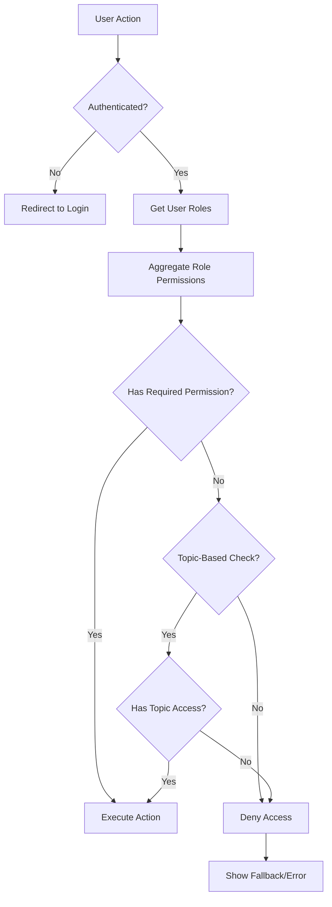

# Permissions & Access Control Documentation

## Overview

This document describes the Role-Based Access Control (RBAC) and Access Control List (ACL) system implemented in the APS Editorial Management System. It covers permission structure, role definitions, topic access rules, and implementation details.

---

## Table of Contents

- [Permission System Overview](#permission-system-overview)
- [Permission Structure](#permission-structure)
- [Core Permissions](#core-permissions)
- [Role Definitions](#role-definitions)
- [Topic-Based Access Control](#topic-based-access-control)
- [Permission Checking](#permission-checking)
- [Frontend Permission Guards](#frontend-permission-guards)
- [Backend Authorization](#backend-authorization)
- [Permission Inheritance](#permission-inheritance)
- [Best Practices](#best-practices)

---

## Permission System Overview

### RBAC (Role-Based Access Control)

The system uses RBAC where:
1. **Users** are assigned to one or more **Roles**
2. **Roles** have a set of **Privileges/Permissions**
3. **Permissions** define what actions can be performed on resources

### ACL (Access Control Lists)

Additional fine-grained access control:
1. **Topic Access**: Users can be restricted to specific topics
2. **Resource Ownership**: Users can manage their own resources
3. **Hierarchical Permissions**: Some roles have broader access than others

### Permission Flow



---

## Permission Structure

### Permission Format

Permissions follow the format: `resource.action.scope`

**Components:**
- **Resource**: What entity (articles, users, roles, etc.)
- **Action**: What operation (create, read, update, delete, publish, etc.)
- **Scope**: Access level (all, topic, own) - optional

**Examples:**
```
articles.create          → Create articles
articles.read.all        → Read all articles
articles.read.topic      → Read articles in assigned topics
articles.read.own        → Read only own articles
articles.update.own      → Update only own articles
articles.publish.all     → Publish any article
users.create             → Create users
users.update             → Update users
roles.read               → View roles
logs.read.all            → View all logs
```

### Permission Hierarchy

```
all > topic > own

articles.read.all        → Can read ALL articles
articles.read.topic      → Can read articles in assigned topics only
articles.read.own        → Can read own articles only
```

---

## Core Permissions

### User Management Permissions

| Permission | Description | Typical Roles |
|------------|-------------|---------------|
| `users.create` | Create new users | Admin |
| `users.read` | View user list | Admin, Editor-in-Chief |
| `users.read.own` | View own profile | All |
| `users.update` | Update any user | Admin |
| `users.update.own` | Update own profile | All |
| `users.delete` | Delete users | Admin |
| `users.block` | Block user accounts | Admin |

### Role Management Permissions

| Permission | Description | Typical Roles |
|------------|-------------|---------------|
| `roles.create` | Create new roles | Admin |
| `roles.read` | View roles list | Admin, Editor-in-Chief |
| `roles.update` | Update role details | Admin |
| `roles.delete` | Delete roles | Admin |
| `roles.privileges.read` | View role privileges | Admin |
| `roles.privileges.update` | Modify role privileges | Admin |
| `roles.users.add` | Assign users to roles | Admin |
| `roles.users.remove` | Remove users from roles | Admin |

### Article Management Permissions

| Permission | Description | Typical Roles |
|------------|-------------|---------------|
| `articles.create` | Create new articles | Journalist, Editor |
| `articles.create.topic` | Create in assigned topics | Journalist |
| `articles.read.all` | Read all articles | Editor-in-Chief, Admin |
| `articles.read.topic` | Read articles in topics | Topic Editor |
| `articles.read.own` | Read own articles | Journalist |
| `articles.update.all` | Update any article | Editor-in-Chief |
| `articles.update.topic` | Update in assigned topics | Topic Editor |
| `articles.update.own` | Update own articles | Journalist |
| `articles.delete.all` | Delete any article | Admin |
| `articles.delete.topic` | Delete in assigned topics | Topic Editor |
| `articles.publish.all` | Publish any article | Editor-in-Chief |
| `articles.publish.topic` | Publish in assigned topics | Topic Editor |
| `articles.review` | Review submitted articles | Topic Editor, Editor-in-Chief |

### Content Management Permissions

| Permission | Description | Typical Roles |
|------------|-------------|---------------|
| `categories.create` | Create categories | Admin, Editor-in-Chief |
| `categories.read` | View categories | All |
| `categories.update` | Update categories | Admin |
| `categories.delete` | Delete categories | Admin |
| `tags.create` | Create tags | Journalist, Editor |
| `tags.read` | View tags | All |
| `tags.update` | Update tags | Editor |
| `tags.delete` | Delete tags | Admin |

### Media Management Permissions

| Permission | Description | Typical Roles |
|------------|-------------|---------------|
| `media.upload` | Upload media files | Journalist, Editor |
| `media.upload.limited` | Limited uploads (size/count) | Contributor |
| `media.read` | View media library | All |
| `media.update` | Update media metadata | Editor |
| `media.delete` | Delete media files | Admin, Editor-in-Chief |

### Topic Management Permissions

| Permission | Description | Typical Roles |
|------------|-------------|---------------|
| `topics.create` | Create new topics | Admin |
| `topics.read` | View topics | All |
| `topics.update` | Update topic settings | Admin |
| `topics.delete` | Delete topics | Admin |
| `topics.assign` | Assign users to topics | Admin |

### Logging & Monitoring Permissions

| Permission | Description | Typical Roles |
|------------|-------------|---------------|
| `logs.read.all` | View all logs | Admin |
| `logs.read.own` | View own activity logs | All |
| `logs.export` | Export log data | Admin |
| `sessions.view` | View active sessions | Admin |
| `sessions.terminate` | End user sessions | Admin |

### System Configuration Permissions

| Permission | Description | Typical Roles |
|------------|-------------|---------------|
| `system.config` | Access system settings | Admin |
| `system.backup` | Create backups | Admin |
| `system.restore` | Restore from backup | Admin |

---

## Role Definitions

### System Administrator

**Description:** Full system access with all privileges.

**Permissions:**
```json
[
  "users.*",
  "roles.*",
  "articles.*",
  "topics.*",
  "categories.*",
  "tags.*",
  "media.*",
  "logs.*",
  "system.*"
]
```

**Capabilities:**
- Manage users and roles
- Configure system settings
- Access all content
- View all logs
- Manage topics and categories

---

### Editor-in-Chief

**Description:** Oversees all editorial content across all topics.

**Permissions:**
```json
[
  "articles.read.all",
  "articles.update.all",
  "articles.delete.all",
  "articles.publish.all",
  "articles.review",
  "users.read",
  "categories.read",
  "categories.create",
  "tags.read",
  "media.read",
  "media.upload",
  "media.delete",
  "logs.read.own"
]
```

**Capabilities:**
- Read/edit/publish any article
- Review submitted content
- View user list
- Manage categories
- Upload and delete media

---

### Topic Editor

**Description:** Manages content within assigned topics.

**Permissions:**
```json
[
  "articles.create.topic",
  "articles.read.topic",
  "articles.update.topic",
  "articles.publish.topic",
  "articles.review",
  "categories.read",
  "tags.create",
  "tags.read",
  "media.upload",
  "media.read",
  "logs.read.own"
]
```

**Topic Assignment:** Restricted to specific topics (e.g., Politics, Economy)

**Capabilities:**
- Create/edit articles in assigned topics
- Review and approve articles
- Publish articles in assigned topics
- Upload media
- Create tags

---

### Journalist / Writer

**Description:** Creates and manages own articles.

**Permissions:**
```json
[
  "articles.create.topic",
  "articles.read.own",
  "articles.update.own",
  "categories.read",
  "tags.read",
  "media.upload",
  "media.read",
  "logs.read.own"
]
```

**Topic Assignment:** Assigned to specific topics

**Capabilities:**
- Create articles in assigned topics
- Edit own unpublished articles
- Upload media
- View tags and categories
- Submit articles for review

---

### Contributor

**Description:** Limited content creation capabilities.

**Permissions:**
```json
[
  "articles.create.topic",
  "articles.read.own",
  "articles.update.own",
  "categories.read",
  "tags.read",
  "media.upload.limited",
  "logs.read.own"
]
```

**Capabilities:**
- Create draft articles
- Edit own drafts only
- Limited media uploads
- View categories and tags

---

## Topic-Based Access Control

### Topic Assignment

Users can be assigned to one or more topics:

```json
{
  "userId": 123,
  "username": "john.doe",
  "roles": [2],  // Journalist role
  "topics": [1, 3, 5]  // Politics, Culture, Sports
}
```

### Topic Access Rules

1. **No Topic Assignment** → No article access (except admins)
2. **Topic Assignment** → Access to articles in those topics only
3. **Admin/Editor-in-Chief** → Access to all topics regardless of assignment

### Topic Scope Checking

```javascript
// Backend: Check if user has access to topic
function hasTopicAccess(userId, topicId) {
  const user = getUserById(userId);
  
  // Admins and Editor-in-Chief have access to all topics
  if (user.roles.includes('admin') || user.roles.includes('editor-in-chief')) {
    return true;
  }
  
  // Check if user is assigned to the topic
  return user.topics.includes(topicId);
}

// Backend: Filter articles by user's topic access
function getArticlesForUser(userId) {
  const user = getUserById(userId);
  
  if (hasPermission(user, 'articles.read.all')) {
    return getAllArticles();
  }
  
  if (hasPermission(user, 'articles.read.topic')) {
    return getArticlesByTopics(user.topics);
  }
  
  if (hasPermission(user, 'articles.read.own')) {
    return getArticlesByAuthor(userId);
  }
  
  return [];
}
```

---

## Permission Checking

### Frontend Permission Checking

#### Using PermissionGuard Component

```jsx
import PermissionGuard from '../helpers/PermissionGuard';

function ArticlesPage() {
  return (
    <div>
      {/* Only show create button if user has permission */}
      <PermissionGuard
        requiredPermission="articles.create"
        element={<CreateArticleButton />}
        fallback={null}
      />
      
      {/* Show different UI based on permission */}
      <PermissionGuard
        requiredPermission="articles.publish"
        element={<PublishButton />}
        fallback={<RequestReviewButton />}
      />
    </div>
  );
}
```

#### Manual Permission Check

```jsx
import { useContext } from 'react';
import { AuthContexte } from '../Context/AuthContext';

function ArticleActions({ article }) {
  const { userPrivileges } = useContext(AuthContexte);
  
  const canEdit = userPrivileges.includes('articles.update');
  const canPublish = userPrivileges.includes('articles.publish');
  const canDelete = userPrivileges.includes('articles.delete');
  
  return (
    <div>
      {canEdit && <EditButton />}
      {canPublish && <PublishButton />}
      {canDelete && <DeleteButton />}
    </div>
  );
}
```

---

### Backend Authorization

#### Middleware-Based Checking

```javascript
// Middleware to check permission
function authorize(permission) {
  return (req, res, next) => {
    const user = req.user;  // Set by authentication middleware
    
    if (!user) {
      return res.status(401).json({ 
        success: false, 
        message: 'Authentication required' 
      });
    }
    
    if (!hasPermission(user, permission)) {
      return res.status(403).json({ 
        success: false, 
        message: 'Permission denied' 
      });
    }
    
    next();
  };
}

// Usage in routes
router.post('/articles/create', 
  authenticate,
  authorize('articles.create'),
  articleController.create
);
```

#### Helper Function

```javascript
function hasPermission(user, requiredPermission) {
  // Get all permissions from user's roles
  const userPermissions = getUserPermissions(user.id);
  
  // Check for exact match
  if (userPermissions.includes(requiredPermission)) {
    return true;
  }
  
  // Check for wildcard permissions
  const [resource, action, scope] = requiredPermission.split('.');
  
  // Check for resource.* (e.g., articles.*)
  if (userPermissions.includes(`${resource}.*`)) {
    return true;
  }
  
  // Check for *.* (super admin)
  if (userPermissions.includes('*.*')) {
    return true;
  }
  
  return false;
}
```

#### Topic-Scoped Authorization

```javascript
async function authorizeArticleAccess(req, res, next) {
  const user = req.user;
  const articleId = req.params.id;
  
  const article = await getArticle(articleId);
  
  // Check if user has global access
  if (hasPermission(user, 'articles.read.all')) {
    return next();
  }
  
  // Check if user has topic access
  if (hasPermission(user, 'articles.read.topic')) {
    if (user.topics.includes(article.topicId)) {
      return next();
    }
  }
  
  // Check if user owns the article
  if (hasPermission(user, 'articles.read.own')) {
    if (article.authorId === user.id) {
      return next();
    }
  }
  
  return res.status(403).json({ 
    success: false, 
    message: 'Access denied to this article' 
  });
}
```

---

## Permission Inheritance

### Role Hierarchy

```
Administrator
    ↓ (inherits all)
Editor-in-Chief
    ↓ (inherits content management)
Topic Editor
    ↓ (inherits basic editing)
Journalist
    ↓ (inherits reading)
Contributor
```

### Inherited Permissions Example

When Topic Editor role has `articles.update.topic`, it implicitly includes:
- `articles.read.topic` (must read to update)
- `categories.read` (must see categories to assign)
- `tags.read` (must see tags to assign)

---

## Best Practices

### For Developers

1. **Always Check Permissions**
   - Never assume user has access
   - Check both on frontend (UX) and backend (security)

2. **Use Least Privilege**
   - Grant minimum permissions needed
   - Start restrictive, expand as needed

3. **Test Permission Scenarios**
   - Test with different roles
   - Test edge cases (no permission, partial access)

4. **Log Permission Denials**
   - Track denied attempts for security monitoring
   - Helps identify permission configuration issues

5. **Document Custom Permissions**
   - If adding new permissions, document them
   - Update role definitions accordingly

### For Administrators

1. **Regular Permission Audits**
   - Review role permissions quarterly
   - Remove unnecessary permissions

2. **Principle of Separation of Duties**
   - Don't give one user too many privileges
   - Separate sensitive operations (create vs publish)

3. **Topic Assignment Accuracy**
   - Ensure users are assigned to correct topics
   - Review assignments when roles change

4. **Monitor Permission Usage**
   - Track which permissions are actually used
   - Identify unused or over-granted permissions

5. **Emergency Access Procedures**
   - Have process for urgent permission grants
   - Temporary elevated access with expiration

### For Users

1. **Request Only Needed Permissions**
   - Don't request unnecessary access
   - Explain why you need specific permissions

2. **Report Permission Issues**
   - If you can't access something you should, report it
   - If you can access something you shouldn't, report it

3. **Respect Access Boundaries**
   - Don't attempt to bypass permissions
   - Don't share credentials to gain access

---

## Permission Database Schema

### Simplified Schema

```sql
-- Privileges table
CREATE TABLE privileges (
  id_privilege SERIAL PRIMARY KEY,
  name VARCHAR(100) UNIQUE NOT NULL,  -- e.g., "articles.create"
  description TEXT,
  resource VARCHAR(50),                -- e.g., "articles"
  action VARCHAR(50),                  -- e.g., "create"
  scope VARCHAR(50)                    -- e.g., "topic", "own", "all"
);

-- Role-Privilege mapping
CREATE TABLE role_privileges (
  id_role INT REFERENCES roles(id_role),
  id_privilege INT REFERENCES privileges(id_privilege),
  PRIMARY KEY (id_role, id_privilege)
);

-- User-Topic mapping (for topic-scoped access)
CREATE TABLE user_topics (
  id_user INT REFERENCES users(id_user),
  id_topic INT REFERENCES topics(id_topic),
  assigned_at TIMESTAMP DEFAULT CURRENT_TIMESTAMP,
  assigned_by INT REFERENCES users(id_user),
  PRIMARY KEY (id_user, id_topic)
);
```

---

## Common Permission Scenarios

### Scenario 1: Journalist Creates Article

```javascript
// User: john.doe (Journalist, assigned to Politics topic)
// Action: Create article in Politics topic

// Permission check:
hasPermission(user, 'articles.create') → true
hasTopicAccess(user, topicId=1) → true  // Politics

// Result: ✅ Allowed
```

### Scenario 2: Journalist Tries to Publish

```javascript
// User: john.doe (Journalist)
// Action: Publish article

// Permission check:
hasPermission(user, 'articles.publish') → false

// Result: ❌ Denied - Must submit for review
```

### Scenario 3: Topic Editor Reviews Article

```javascript
// User: editor.politics (Topic Editor, Politics)
// Action: Approve article in Politics topic

// Permission check:
hasPermission(user, 'articles.review') → true
hasTopicAccess(user, topicId=1) → true

// Result: ✅ Allowed
```

### Scenario 4: Topic Editor Tries Different Topic

```javascript
// User: editor.politics (Topic Editor, Politics only)
// Action: Edit article in Economy topic

// Permission check:
hasPermission(user, 'articles.update.topic') → true
hasTopicAccess(user, topicId=2) → false  // Economy not assigned

// Result: ❌ Denied - Not assigned to Economy topic
```

### Scenario 5: Admin Override

```javascript
// User: admin (Administrator)
// Action: Any action on any resource

// Permission check:
hasPermission(user, '*.*') → true
// OR
isAdmin(user) → true (automatic bypass)

// Result: ✅ Allowed
```

---

## Troubleshooting

### User Can't Access Expected Resource

1. **Check Role Assignment**
   ```sql
   SELECT r.name 
   FROM user_roles ur
   JOIN roles r ON ur.id_role = r.id_role
   WHERE ur.id_user = 123;
   ```

2. **Check Role Permissions**
   ```sql
   SELECT p.name 
   FROM role_privileges rp
   JOIN privileges p ON rp.id_privilege = p.id_privilege
   WHERE rp.id_role = 2;
   ```

3. **Check Topic Assignment**
   ```sql
   SELECT t.name 
   FROM user_topics ut
   JOIN topics t ON ut.id_topic = t.id_topic
   WHERE ut.id_user = 123;
   ```

4. **Check JWT Token**
   - Verify token includes correct roles and privileges
   - Check token expiration
   - Ensure token is refreshed after role changes

### Permission Denied But Should Work

1. **Clear Browser Cache** - Old permissions may be cached
2. **Re-login** - Refresh JWT token with latest permissions
3. **Check Backend Logs** - See exact permission that was checked
4. **Verify Database** - Ensure permission exists and is assigned

---

## Related Documentation

- [Workflow Documentation](./workflow.md)
- [API Documentation](./api.md)
- [Security Practices](./security.md)
- [Database Schema](./database-schema.md)

---

**Last Updated**: 2024
**Document Version**: 1.0
