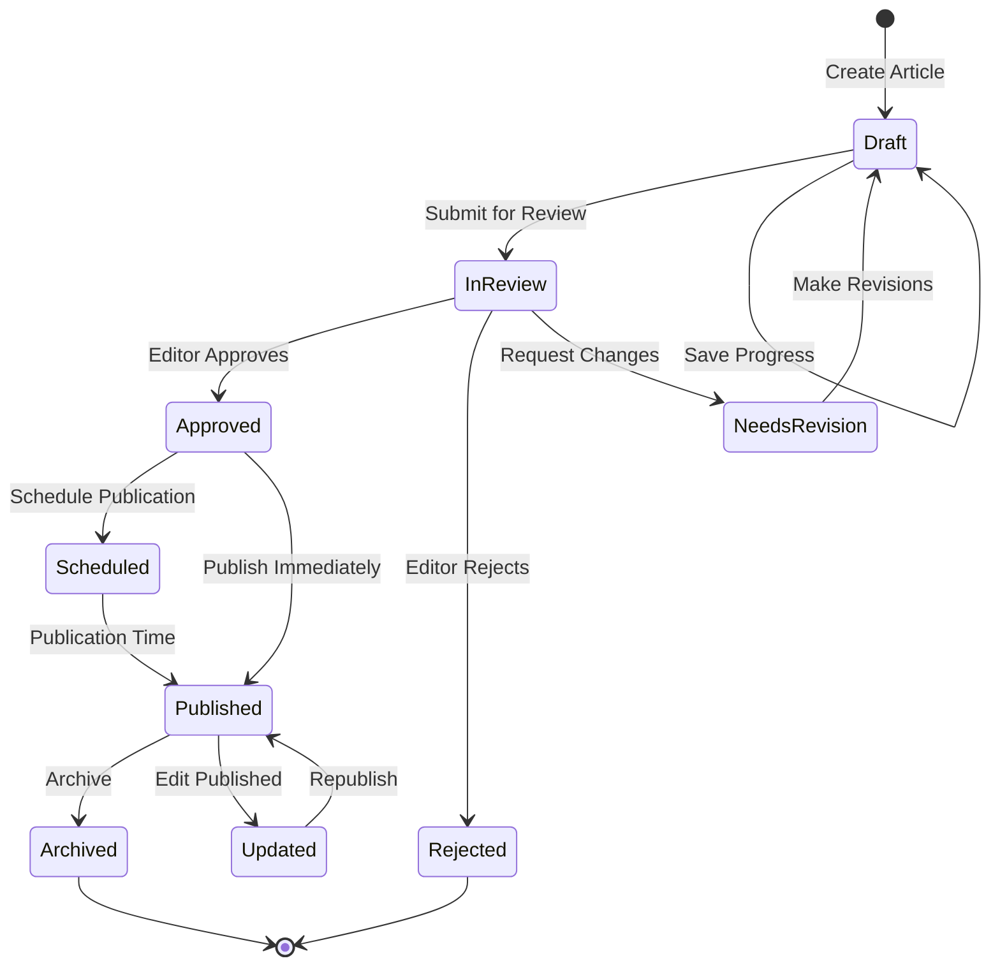
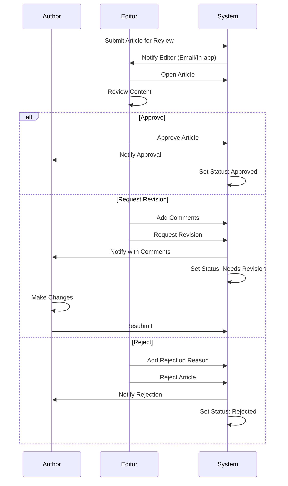

# Editorial Workflow Documentation

## Overview

This document describes the editorial workflows, roles, and article lifecycle management in the APS Editorial Management System.

---

## Table of Contents

- [Editorial Roles](#editorial-roles)
- [Article Lifecycle](#article-lifecycle)
- [Topic-Based Workflow](#topic-based-workflow)
- [Permissions & Access Control](#permissions--access-control)
- [Content Review Process](#content-review-process)
- [Publishing Workflow](#publishing-workflow)
- [Collaborative Features](#collaborative-features)

---

## Editorial Roles

### Role Hierarchy

```
┌─────────────────────────────────────┐
│      System Administrator           │  (Full System Access)
└─────────────────────────────────────┘
              ↓
┌─────────────────────────────────────┐
│      Editor-in-Chief                │  (All Topics Access)
└─────────────────────────────────────┘
              ↓
┌─────────────────────────────────────┐
│      Topic Editors                  │  (Topic-Specific Access)
└─────────────────────────────────────┘
              ↓
┌─────────────────────────────────────┐
│      Journalists/Writers            │  (Content Creation)
└─────────────────────────────────────┘
              ↓
┌─────────────────────────────────────┐
│      Contributors                   │  (Limited Access)
└─────────────────────────────────────┘
```

### Role Definitions

#### 1. System Administrator
**Responsibilities:**
- Manage user accounts and roles
- Configure system settings
- Monitor system logs and security
- Manage topics and categories
- Full database access

**Permissions:**
- `users.*` - Full user management
- `roles.*` - Full role management
- `topics.*` - Topic management
- `categories.*` - Category management
- `logs.*` - Log access
- `system.config` - System configuration

#### 2. Editor-in-Chief
**Responsibilities:**
- Oversee all editorial content
- Approve/reject articles for publication
- Manage editorial calendar
- Assign articles to topic editors
- Monitor content quality

**Permissions:**
- `articles.read` - View all articles
- `articles.update` - Edit any article
- `articles.publish` - Publish articles
- `articles.delete` - Remove articles
- `topics.read` - View all topics
- `users.read` - View user list

#### 3. Topic Editor
**Responsibilities:**
- Manage articles within assigned topics
- Review and edit submitted content
- Assign articles to writers
- Schedule publications
- Ensure topic-specific quality standards

**Permissions:**
- `articles.read` (topic-scoped)
- `articles.create` (in assigned topics)
- `articles.update` (in assigned topics)
- `articles.review`
- `categories.read`
- `tags.read`

#### 4. Journalist/Writer
**Responsibilities:**
- Create article drafts
- Submit articles for review
- Revise articles based on feedback
- Upload media (images, videos)
- Add metadata (tags, categories)

**Permissions:**
- `articles.create`
- `articles.read` (own articles)
- `articles.update` (own articles)
- `media.upload`
- `tags.read`
- `categories.read`

#### 5. Contributor
**Responsibilities:**
- Submit article drafts
- Provide content in specific areas
- Limited editing capabilities

**Permissions:**
- `articles.create` (limited)
- `articles.read` (own articles only)
- `media.upload` (limited)

---

## Article Lifecycle

### Lifecycle States



### State Descriptions

#### 1. **Draft**
- Initial state when article is created
- Author can edit freely
- Not visible to readers
- Can be saved multiple times
- Auto-save every 30 seconds

**Available Actions:**
- Edit content
- Add/remove media
- Set categories and tags
- Submit for review
- Delete draft

#### 2. **In Review**
- Submitted to topic editor for review
- Read-only for author
- Editor can add comments
- Editor can request revisions

**Available Actions:**
- Editor: Approve, Reject, Request Revision
- Author: View comments, wait for decision

#### 3. **Needs Revision**
- Editor has requested changes
- Returns to Draft state
- Author receives notification with comments
- Must resubmit after revisions

**Available Actions:**
- Author: Make changes, resubmit
- Editor: View progress

#### 4. **Approved**
- Editor has approved content
- Ready for publication
- Can be scheduled or published immediately
- Final checks can still be made

**Available Actions:**
- Schedule publication
- Publish immediately
- Make minor edits

#### 5. **Scheduled**
- Publication date/time set
- Automatic publication at scheduled time
- Can be rescheduled or unpublished before time

**Available Actions:**
- Change schedule
- Cancel schedule (return to Approved)
- Publish early

#### 6. **Published**
- Live on the website
- Visible to readers
- Can still be edited (creates new version)
- Analytics tracking active

**Available Actions:**
- Edit (with version control)
- Unpublish
- Archive
- View analytics

#### 7. **Archived**
- No longer visible on main site
- Preserved for historical record
- Can be unarchived if needed
- Still accessible via direct link

**Available Actions:**
- Unarchive
- Permanently delete (admin only)

#### 8. **Rejected**
- Editor has rejected the article
- Not publishable in current form
- Author receives rejection reason
- Can create new article based on feedback

**Available Actions:**
- View rejection reason
- Delete article
- Create new article

---

## Topic-Based Workflow

### Topic Structure

Topics represent subject areas or news categories (e.g., Politics, Economy, Sports, Culture).

```
Topic: Politics
├── Pool (All Articles)
│   ├── Draft Articles
│   ├── In Review Articles
│   ├── Published Articles
│   └── Archived Articles
│
└── Follow (Assigned to Me)
    ├── Articles I'm Writing
    ├── Articles I'm Reviewing
    └── Articles I'm Editing
```

### Pool View

The **Pool** shows all articles within a topic:

**Features:**
- Filter by state (Draft, Review, Published, etc.)
- Search by title, author, tags
- Sort by date, author, views
- Bulk actions (for editors)
- Quick preview
- Article statistics

**Actions by Role:**
- **Topic Editor**: View all, assign, review, publish
- **Journalist**: View published, view own drafts
- **Contributor**: View own articles only

### Follow View

The **Follow** view shows articles assigned to or created by the current user:

**Features:**
- Personal dashboard
- Articles requiring action
- Recent activity
- Deadlines and reminders
- Quick access to drafts

**Use Cases:**
- Journalist sees articles they're writing
- Editor sees articles awaiting review
- Editor-in-Chief sees articles pending approval

---

## Permissions & Access Control

### Permission System

Permissions follow the format: `resource.action.scope`

**Examples:**
- `articles.read.all` - Read all articles
- `articles.read.topic` - Read articles in assigned topics
- `articles.read.own` - Read own articles only
- `articles.create.topic` - Create articles in assigned topics
- `articles.publish.all` - Publish any article

### Permission Matrix

| Role | Create | Read | Update | Delete | Publish | Review |
|------|--------|------|--------|--------|---------|--------|
| Admin | ✅ All | ✅ All | ✅ All | ✅ All | ✅ All | ✅ All |
| Editor-in-Chief | ✅ All | ✅ All | ✅ All | ✅ All | ✅ All | ✅ All |
| Topic Editor | ✅ Topic | ✅ Topic | ✅ Topic | ❌ | ✅ Topic | ✅ Topic |
| Journalist | ✅ Topic | ✅ Own | ✅ Own | ❌ | ❌ | ❌ |
| Contributor | ✅ Limited | ✅ Own | ✅ Own | ❌ | ❌ | ❌ |

### Dynamic Permission Loading

Permissions are loaded from the backend on login:

```javascript
// Example permission response
{
  "privileges": [
    "articles.create.topic",
    "articles.read.topic",
    "articles.update.own",
    "media.upload",
    "tags.read",
    "categories.read"
  ]
}
```

The frontend checks permissions before rendering components:

```jsx
<PermissionGuard
  requiredPermission="articles.create"
  element={<CreateButton />}
  fallback={null}
/>
```

---

## Content Review Process

### Review Workflow



### Review Checklist

Editors should verify:

#### Content Quality
- [ ] Accuracy of information
- [ ] Proper grammar and spelling
- [ ] Appropriate tone for APS
- [ ] No plagiarism
- [ ] Sources cited correctly

#### Structure
- [ ] Clear headline
- [ ] Engaging introduction
- [ ] Logical flow
- [ ] Proper conclusion
- [ ] Appropriate length

#### Metadata
- [ ] Correct categories assigned
- [ ] Relevant tags added
- [ ] Proper topic classification
- [ ] Author attribution correct

#### Media
- [ ] Images are relevant
- [ ] Image quality is acceptable
- [ ] Captions are descriptive
- [ ] Copyright/credits included
- [ ] Alt text for accessibility

#### SEO & Readability
- [ ] SEO-friendly title
- [ ] Meta description present
- [ ] Keywords included naturally
- [ ] Readable paragraph length
- [ ] Subheadings used appropriately

---

## Publishing Workflow

### Immediate Publication

**Process:**
1. Article is in **Approved** state
2. Editor clicks "Publish Now"
3. System validates article completeness
4. Article moves to **Published** state
5. Notification sent to subscribers
6. Analytics tracking begins
7. Article appears on website immediately

### Scheduled Publication

**Process:**
1. Article is in **Approved** state
2. Editor sets publication date/time
3. Article moves to **Scheduled** state
4. Cron job checks for scheduled articles
5. At scheduled time:
   - Article publishes automatically
   - Notifications sent
   - Status changes to **Published**

**Scheduling Features:**
- Set date and time (with timezone)
- Preview how it will appear
- Change schedule before publication
- Cancel schedule and return to Approved
- Publish early if needed

### Publication Validation

Before publishing, the system checks:

- ✅ Title is not empty
- ✅ Content has minimum length
- ✅ At least one category assigned
- ✅ Featured image present (recommended)
- ✅ Author attribution included
- ✅ No security violations (XSS/SQL)
- ✅ All required fields filled

---

## Collaborative Features

### Comments & Feedback

**In-Article Comments:**
- Editors can add comments to specific paragraphs
- Authors receive notifications
- Comments visible in Draft/Review states
- Comments resolved when addressed

**Review Notes:**
- Overall feedback on the article
- Suggestions for improvement
- Links to reference materials
- Checklist of required changes

### Notifications

Users receive notifications for:

- Article submitted for review
- Article approved
- Article rejected
- Revision requested
- Comments added
- Article published
- Deadline approaching

**Notification Channels:**
- In-app notifications
- Email notifications
- Browser push notifications (if enabled)

### Version Control

Every edit creates a new version:

- **Version History**: View all previous versions
- **Compare Versions**: See what changed
- **Restore Version**: Rollback if needed
- **Audit Trail**: Who changed what and when

### Collaborative Editing

**Features:**
- Lock article when being edited (prevents conflicts)
- Show who is currently editing
- Auto-save every 30 seconds
- Conflict detection and resolution

---

## Best Practices

### For Authors

1. **Write Clear Headlines**: Make them descriptive and engaging
2. **Use Proper Structure**: Introduction, body, conclusion
3. **Add Media Early**: Don't wait until the end
4. **Use Tags Wisely**: 3-5 relevant tags per article
5. **Preview Before Submit**: Check how it looks
6. **Respond to Feedback**: Address editor comments promptly

### For Editors

1. **Review Promptly**: Don't leave authors waiting
2. **Be Constructive**: Provide helpful feedback
3. **Use Comments**: Mark specific issues in the text
4. **Check Metadata**: Ensure proper categorization
5. **Verify Sources**: Check facts and citations
6. **Maintain Standards**: Enforce quality guidelines consistently

### For Administrators

1. **Monitor Activity**: Check logs regularly
2. **Manage Permissions**: Review and update as needed
3. **Track Performance**: Monitor article metrics
4. **Train Users**: Provide guidance on workflows
5. **Backup Content**: Ensure regular backups
6. **Update Documentation**: Keep workflow docs current

---

## Troubleshooting

### Common Issues

**Problem: Article stuck in Review**
- **Solution**: Contact the topic editor or escalate to Editor-in-Chief

**Problem: Cannot submit article**
- **Solution**: Check validation errors, ensure all required fields are filled

**Problem: Lost draft changes**
- **Solution**: Check auto-save recovery, contact admin if data loss occurred

**Problem: Permission denied**
- **Solution**: Verify your role has the required permission, contact admin

**Problem: Cannot upload media**
- **Solution**: Check file size (max 5MB), ensure file type is allowed

---

## Workflow Metrics

### Key Performance Indicators (KPIs)

- **Average Review Time**: Time from submission to approval
- **Articles per Day**: Total articles published daily
- **Rejection Rate**: Percentage of articles rejected
- **Revision Cycles**: Average number of revisions needed
- **Time to Publish**: Total time from creation to publication

### Reporting

Generate reports on:
- Articles by state (Draft, Review, Published)
- Articles by topic
- Articles by author
- Review bottlenecks
- Publishing schedule adherence

---

## Related Documentation

- [Permissions & Access Control](./permissions.md)
- [API Documentation](./api.md)
- [Security Practices](./security.md)
- [Database Schema](./database-schema.md)

---

**Last Updated**: 2024
**Document Version**: 1.0
